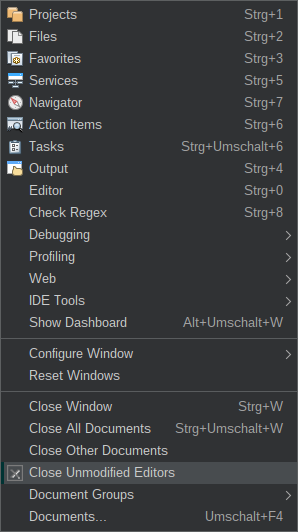
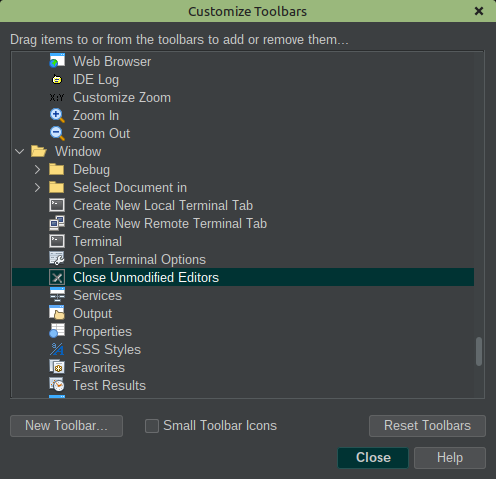
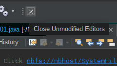
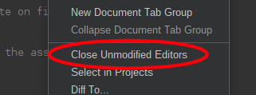

# Close Unmodified Editors

This Netbeans module provides an action to close unmodified files.

You can use the menu `Window -> Close Unmodified Editors` to close all unmodified files.

There is also a toolbar button, which you can add to the toolbar

Last but not least, you can use the context menu of the editor tab

# Changelog

## 1.1.0

- Add action in contextmenu

## 1.0.0

- First Version